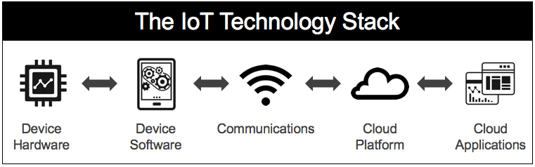

# Stack IoT completo con Docker: Node-RED + SQL Server + InfluxDB + Grafana + Riot Collector



Este proyecto despliega un entorno completo de IoT y análisis de datos utilizando contenedores Docker.  
Incluye servicios de base de datos, visualización, automatización y un recolector de datos de Riot Games.

---

## Servicios incluidos

| Servicio | Puerto | Descripción |
|-----------|---------|--------------|
| **InfluxDB** | `8086` | Base de datos de series temporales |
| **Grafana** | `3000` | Visualización de datos y dashboards |
| **Node-RED** | `1880` | Automatización y creación de flujos |
| **SQL Server** | `1433` | Base de datos relacional de Microsoft |
| **Riot Collector** | — | Script Python para recolectar datos de la API de Riot y enviarlos a InfluxDB |

---

## Requisitos previos

Antes de comenzar, asegúrate de tener instalado:

- [Docker](https://docs.docker.com/get-docker/)  
- [Docker Compose](https://docs.docker.com/compose/install/)  
- Sistema operativo **Linux** (recomendado Ubuntu/Debian)

---

## Configuración inicial

1. **Clona este repositorio:**
   ```bash
   git clone git@github.com:ai-somorrostro/reto0-g4-pia.git
   cd reto0-g4-pia
   ```
2. **Copia el archivo de variables de entorno:**
   ```bash
   cp .env.example .env
   ```
3. **Edita el archivo .env con tus credenciales y preferencias:**
   ```bash
   nano .env
   ```

## Parámetros principales

### InfluxDB
- `INFLUXDB_USERNAME`
- `INFLUXDB_PASSWORD`
- `INFLUXDB_ORG`
- `INFLUXDB_BUCKET`
- `DOCKER_INFLUXDB_INIT_ADMIN_TOKEN`

### SQL Server
- `SQL_SERVER_SA_PASSWORD`

### Riot API
- `RIOT_API_KEY`
- `RIOT_GAME_NAME`
- `RIOT_TAG_LINE`
- `RIOT_ROUTING`

---

## Despliegue de los servicios

Para levantar todos los servicios principales (excepto el collector):

```bash
docker-compose up -d
```
Esto iniciará los contenedores de InfluxDB, Grafana, Node-RED y SQL Server.
La primera vez puede tardar un poco, ya que se crean volúmenes y se inicializan las bases de datos.

Verifica el estado con:
```bash
docker ps
```

## Acceso a los servicios

### InfluxDB
- URL: http://localhost:8086
- Usuario: definido en `.env` `(INFLUXDB_USERNAME)`
- Contraseña: definida en `.env`
- Organización: `INFLUXDB_ORG`
- Bucket: `INFLUXDB_BUCKET`
- Token: `DOCKER_INFLUXDB_INIT_ADMIN_TOKEN`

### Grafana
- URL: http://localhost:3000
- Usuario: `admin` (por defecto)
- Contraseña: `admin` (por defecto)
- Fuente de datos: InfluxDB (ya preconfigurada)

### Node-RED
- URL: http://localhost:1880
- Nodos preinstalados: `node-red-contrib-influxdb`

### SQL Server
- Host: `localhost`
- Puerto: `1433`
- Usuario: `sa`
- Contraseña: definida en `.env`

Puedes conectarte con Azure Data Studio o mediante sqlcmd:

``` bash
docker exec -it sqlserver /opt/mssql-tools18/bin/sqlcmd -S localhost -U sa -P 'tu_password'
```

## Riot Data Collector (manual)

Este servicio no se inicia automáticamente.
Su función es consultar la API de Riot Games, extraer estadísticas de las últimas partidas y guardarlas en InfluxDB.

Ejecutar el recolector:
``` bash 
docker-compose run --rm riot-collector
```

O mediante el script incluido:
```bash
./collect-data.sh
```
El contenedor se ejecutará y se mantendrá jecutanto n segndo plan actualizando los datos cada 2 minutos.

### Datos recolectados

El script envía a InfluxDB con los siguientes campos:
- Jugador
- Campeón
- Rol
- Kills, Deaths, Assists
- Vision Score, Gold Earned
- Resultado (Win/Lose)
- Duración de partida
- Modo de juego

Estos datos pueden visualizarse en Grafana mediante dashboards preconfigurados o personalizados.

## Comandos útiles

| Acción | Comando |
|---|---|
| Ver logs generales | `docker-compose logs -f` |
| Ver logs de un servicio | `docker-compose logs -f grafana` |
| Reiniciar servicios | `docker-compose restart` |
| Detener todos los contenedores | `docker-compose down` |
| Eliminar todo (datos incluidos) | `docker-compose down -v` |

## Personalización

### Añadir plugins a grafana

Edita el `docker-compose.yml` dentro del servicio `grafana`:

``` yml
environment:
  - GF_INSTALL_PLUGINS=grafana-clock-panel,grafana-simple-json-datasource
```

#### Importar dashboards personalizados

1. **Copia los archivos `.json` a:**
```bash
grafana/provisioning/dashboards/
```
2. **Reinicia Grafana:**
```bash
docker-compose restart grafana
```

## Estructura del proyecto

```
.
├── docker-compose.yml
├── .env
├── .env.example
├── Dockerfile.nodered
├── Dockerfile.python
├── requirements.txt
├── riot_collector.py
├── grafana/
│   └── provisioning/
│       ├── datasources/
│       │   └── influxdb.yml
│       └── dashboards/
│           └── dashboards.yml
├── sqlserver/
│   ├── init-scripts/
│   └── init.sh
└── init-buckets.sh

```

## Solución de problemas

### Grafana no se conecta a InfluxDB

1. **Comprueba que InfluxDB está en ejecución:**
``` bash
docker ps | grep influxdb
```

2. **Revisa el token en:**
``` bash
grafana/provisioning/datasources/influxdb.yml
```

3. **Revisa logs:**
```bash
docker-compose logs grafana
```

### No aparecen datos en Grafana

- Ejecuta el collector: 
``` bash
docker-compose run --rm riot-collector
```
- Verifica los buckets en InfluxDB: 
http://localhost:8086
- Ajusta el rango temporal en el dashboard.

### Permisos en volúmenes (Grafana)

``` bash
sudo chown -R 472:472 grafana/
```
sirve para cambiar el propietario (dueño) y el grupo de todos los archivos y carpetas dentro de grafana/ al usuario y grupo con ID 472, de forma recursiva (-R).

## Conclusión

Con este entorno Dockerizado tendrás un stack completo para:

- Recolectar datos externos (Riot API)
- Almacenarlos en InfluxDB
- Visualizarlos en Grafana
- Automatizar flujos con Node-RED
- Integrar fácilmente con SQL Server

## Creado por:
- Samuel Rivera
- Xabi Vila
- Lander Ortuzar
- Iker Gorostiaga